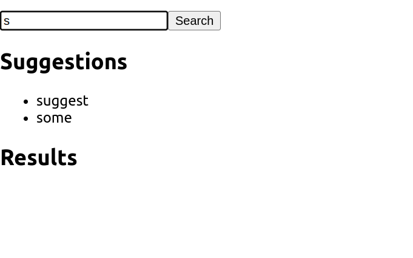
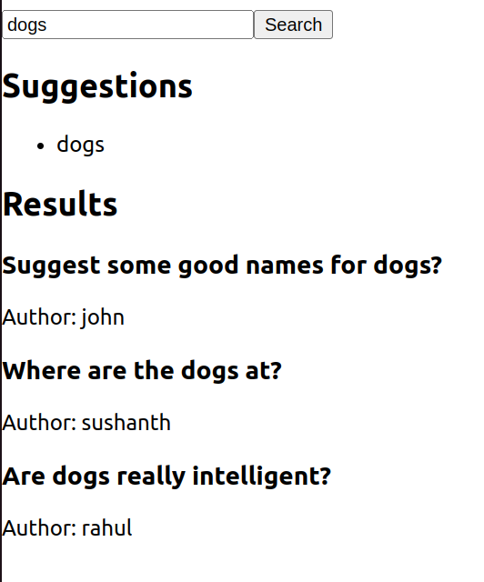

## QUORA

A mini quora application that implements search using tries for suggestions and db indexing.

# Setup
To run the Quora application locally, follow these steps:

1. Clone the repository:
    ```
    git clone https://github.com/SushanthMarada/Quora.git
    ```
2. Install dependencies:
   ```
   npm install
   ```

3. Set up environment variables:
   - Create a `.env` file in the root directory.
   - Add necessary environment variables (e.g., `MONGO_URI`, `PORT`).

4. Start the server and front end for the search feature:
   ```
   node index.js
   cd app
   PORT=3015 npm start {anything other than 3000 works bcoz of the node too running in the same port}
   ```

5. Access the application in your browser at `http://localhost:3015` (or the specified port).

<a name="features"></a>
## Features

The Quora application provides several key functionalities:

<a name="user-management"></a>
### User Management

- **Register**: Users can register by providing their name, email and password.
- **Login**: Existing users can log in to access their accounts.

<a name="question-management"></a>
### Question Management

- **Ask Question**: Users can ask questions which are stored in the database.
- **View Questions**: Users can view existing questions posted by others.

<a name="post-management"></a>
### Post Management

- **Create Post**: Users can create posts with content.
- **View Posts**: All posts are displayed for users to read and interact with.

<a name="answer-management"></a>
### Answer Management

- **Post Answers**: Users can post answers to questions.
- **View Answers**: Answers are displayed under respective questions.

<a name="like-system"></a>
### Like System

- **Like Posts/Answers**: Users can like posts and answers to show appreciation or agreement.

<a name="search-functionality"></a>
### Search Functionality

- **Search**: Users can search for questions using keywords.

<a name="health-check-endpoint"></a>
### Health Check Endpoint

- **/health**: Provides a health check endpoint to verify the status of the server and database connectivity.

<a name="logging-and-graceful-shutdown"></a>
## Logging and Graceful Shutdown

The application utilizes Winston for logging. Logs are recorded both in the console and in a file (`logs/application.log`). Graceful shutdowns ensure that the server closes connections properly on shutdown signals (`SIGINT` and `SIGTERM`).

## Suggestions Feature


## search Results 

